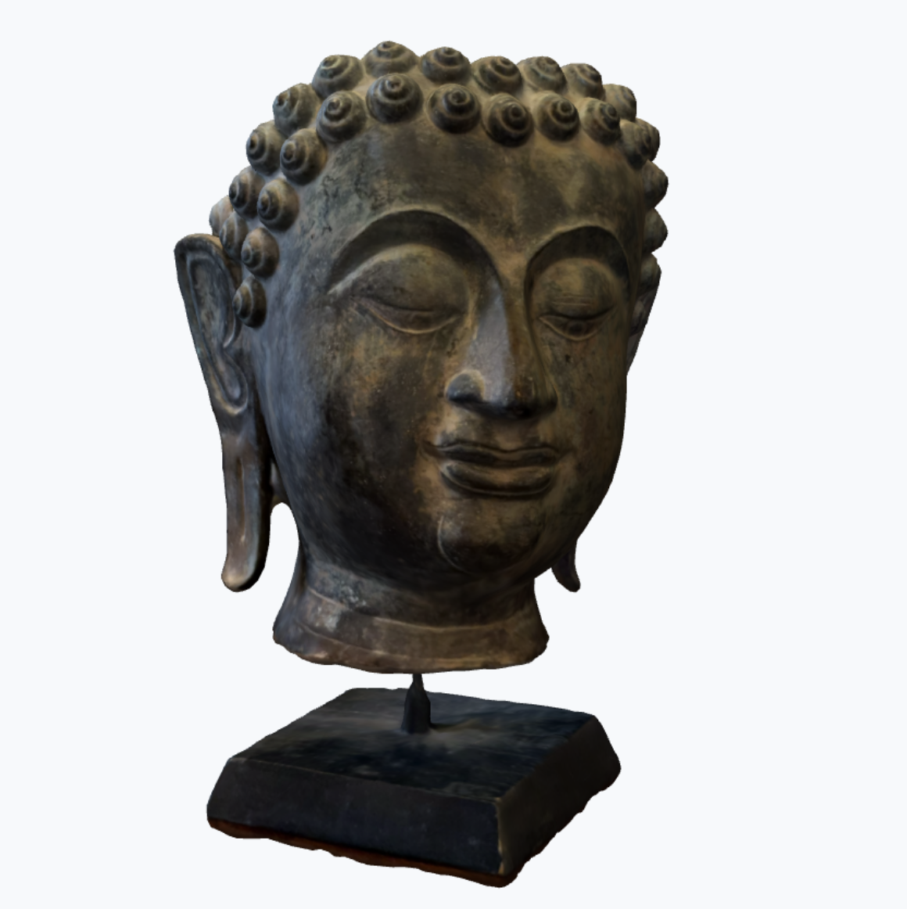

This repository contains the materials for the seminar "3-D reconstruction and printing tools: Fundamentals" presented by Paolo Bosetti at the [AMARCH26](https://eventi.unitn.it/it/amarch-2026) summer school.

# Contents

a. 3-D reconstruction and printing tools: Fundamentals. [](/slides/part_1.qmd)

{width=100%}
