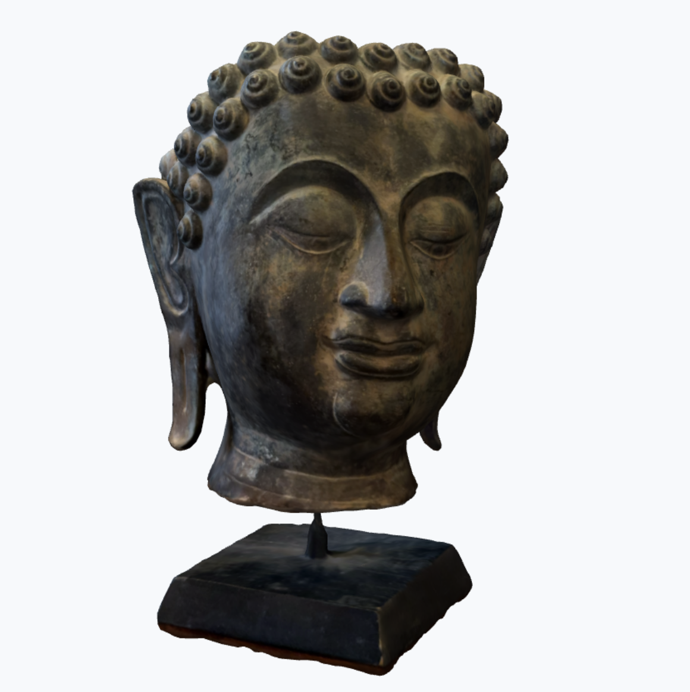
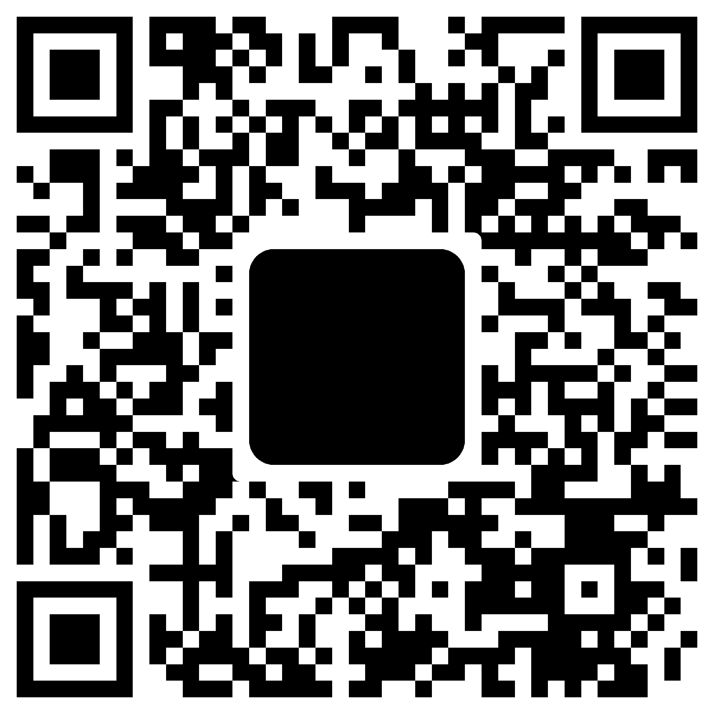

{style="height: 180px; width: 100%; object-fit: cover;"}

This repository contains the materials for the seminar "3-D reconstruction and printing tools: Fundamentals" presented by Paolo Bosetti at the [AMARCH26](https://eventi.unitn.it/it/amarch-2026) summer school.

# Contents

An interactive presentation: *3-D reconstruction and printing tools: Fundamentals* 

::: {.columns}

::: {.column}
* [click here ](/slides/part_1.qmd)
* or scan the QR beside
:::

::: {.column}
[{width=200px}](/slides/part_1.qmd)
:::

:::

---

# License {width=150px}

This work is licensed under a [Creative Commons Attribution-NonCommercial-ShareAlike 4.0 International License](https://creativecommons.org/licenses/by-nc-sa/4.0/).