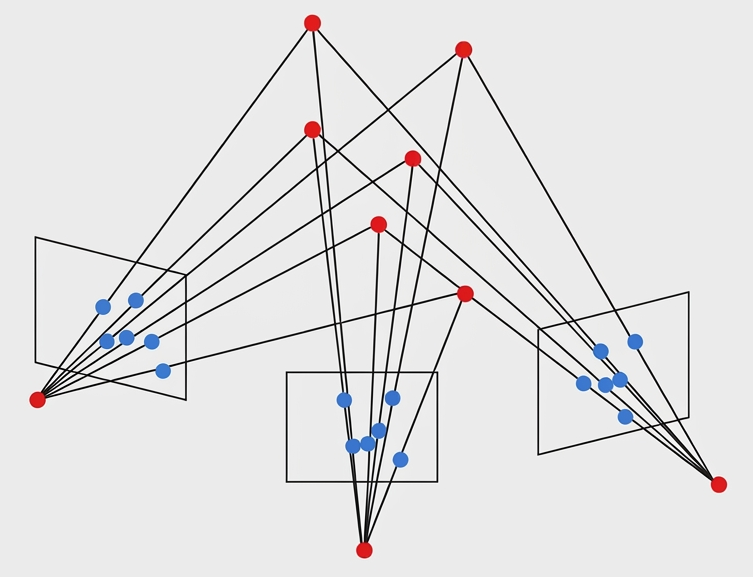
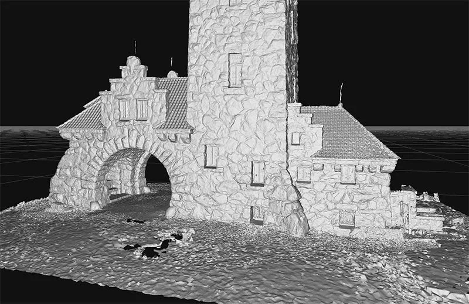
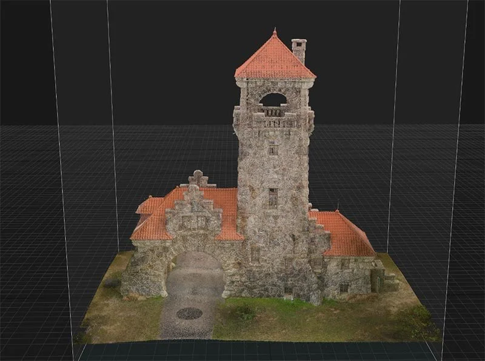
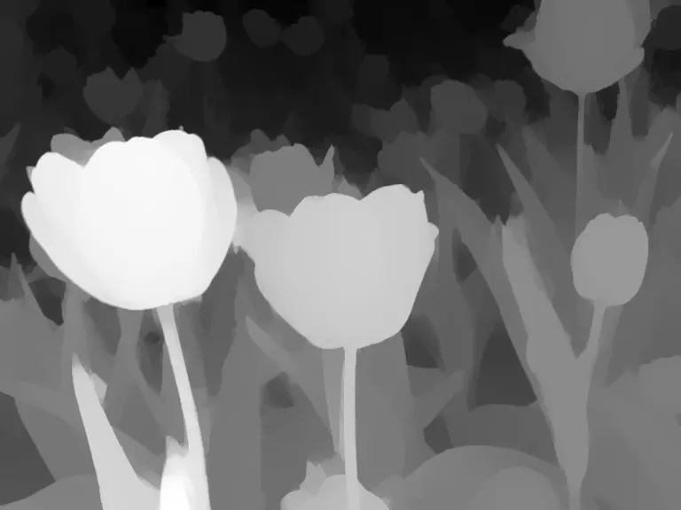
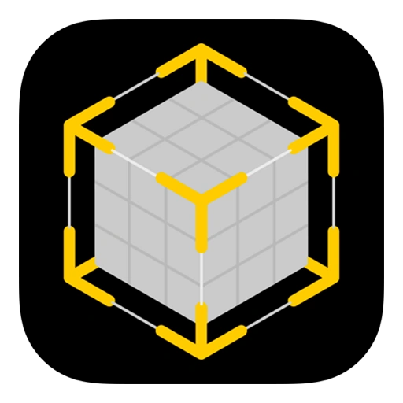
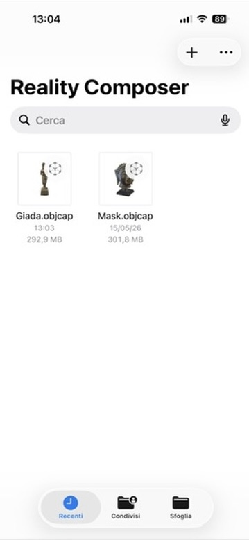
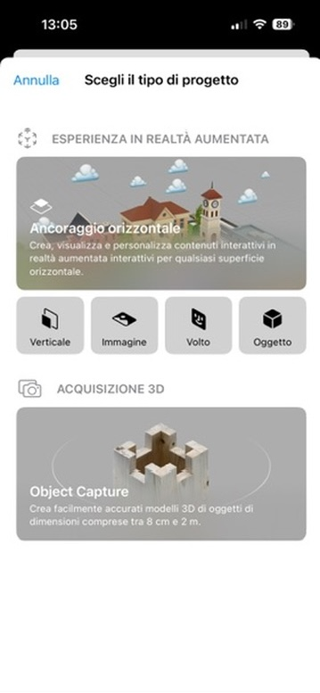

# Contents

1. Context of 3-D technologies in archaeology
2. 3-D reconstruction tools
3. 3-D printing tools

# Context

3-D technologies support archaeological research when replicas and models are treated as documented interpretations of material evidence

## Key references  {.smaller}

*  Balletti, C., & Ballarin, M. (2019). *An Application of Integrated 3D Technologies for Replicas in Cultural Heritage.* ISPRS International Journal of Geo-Information, 8(6), 285. <https://doi.org/10.3390/ijgi8060285>
* Bitelli, G., Forte, A., Tini, M. A., Belfiori, F., & Tirincanti, A. (2025). *High-Detail 3D Reconstruction and Digital Strategies for the Enhancements of Archaeological Properties in Museums.* Heritage, 8(2), 49. <https://doi.org/10.3390/heritage8020049>
* Cecchitelli, M., Fiori, G., Bocchetta, G., Filippi, F., Leccese, F., Galo, J., Sciuto, S. A., & Scorza, A. (2023). *Dimensional assessment in bioarchaeology applications: a preliminary study on quality controls in 3D printing of human skulls.* Proceedings of the 2022 IMEKO TC4 International Conference on Metrology for Archaeology and Cultural Heritage, 98–103. <https://doi.org/10.21014/tc4-arc-2023.020>
* Kantaros, A., Douros, P., Soulis, E., Brachos, K., Ganetsos, T., Peppa, E., Manta, E., & Alysandratou, E. (2025). *3D Imaging and Additive Manufacturing for Original Artifact Preservation Purposes: A Case Study from the Archaeological Museum of Alexandroupolis.* Heritage, 8(2), 80. <https://doi.org/10.3390/heritage8020080>
* Llull, C., Baloian, N., Bustos, B., Kupczik, K., Sipiran, I., & Baloian, A. (2023). *Evaluation of 3D Reconstruction for Cultural Heritage Applications.* 2023 IEEE/CVF International Conference on Computer Vision Workshops (ICCVW), 1634–1643. <https://doi.org/10.1109/iccvw60793.2023.00179>
* Spallone, R., Lamberti, F., Olivieri, L. M., Ronco, F., & Castagna, L. (2022). *AR And VR for Enhancing Museums’ Heritage Through 3d Reconstruction of Fragmented Statue and Architectural Context.* The International Archives of the Photogrammetry, Remote Sensing and Spatial Information Sciences, XLVI-2/W1-2022, 473–480. <https://doi.org/10.5194/isprs-archives-xlvi-2-w1-2022-473-2022>

## Key references 

* **On the Technologies** (Fundamentals): *Additive Manufacturing Technologies: 3D Printing, Rapid Prototyping, and Direct Digital Manufacturing* by Ian Gibson, David Rosen, and Brent Stucker. This is widely considered the gold-standard textbook for understanding the mechanics, materials, and distinct processes (e.g., SLA, SLS, FDM) that make up modern 3D printing.
* **On Their Use in Archaeology**: *3D Information Technologies in Cultural Heritage Preservation and Popularisation* (MDPI Books, 2023). This volume offers a broad compilation of recent case studies focusing heavily on 3D terrestrial laser scanning, photogrammetry, and the application of 3D modeling for archaeological and museum contexts.

## Key References  {.smaller}

* **Photogrammetry for Cultural Heritage Objects** (Video Tutorial) <https://www.youtube.com/watch?v=E2i4DQSsgCU>
  - *Why it's useful*: Practical step-by-step video tutorial on creating 3D models of cultural heritage objects via photogrammetry. Demonstrates photo capture and mesh processing—ideal for archaeologists learning the field-to-digital pipeline.
* **3D Scanning for Cultural Heritage Conservation by Factum Arte** (Online Guide/Lesson) <https://www.factum-arte.com/pag/701/3d-scanning-for-cultural-heritage-conservation>
  - *Why it's useful*: Factum Arte, world leader in digital mediation and heritage preservation, breaks down differences between close-range photogrammetry and laser scanning, explaining when to use each based on artifact material (translucent marble vs. opaque stone) and environment.
* **Complete Beginner's Guide to 3D Printing** (Video Tutorial) <https://www.youtube.com/watch?v=T-Z3GmM20JM>
  - *Why it's useful*: Comprehensive video introduction to fused deposition modeling (FDM). Covers printer components, slicing software (converting 3D models into G-code), and printing process.
* **Decoding Maya Hieroglyphs with 3D Technology** (Educational Video)  
Peabody Museum - Harvard University <https://peabody.harvard.edu/video-decoding-maya-hieroglyphs-3d-technology>
  - *Why it's useful*: Peabody Museum video bridges technology and archaeological value, showing how 3D scanning and printing decode, replicate, and preserve complex structures like the Hieroglyphic Stairway at Copan.


# 3-D Reconstruction

3-D reconstruction converts observations of an artefact, structure, or landscape into a digital model with measurable geometry.

## Technologies and tools

::: {.columns}

::: {.column}
### General workflow

* Capture the object or context with images, projected light, or laser range measurements.
* Register viewpoints in a common coordinate system.
* Generate a point cloud, mesh, texture, and scale reference.
* Clean, document, and export the model for analysis, display, or printing.

:::

::: {.column}
### Method selection

* Surface size, texture, reflectance, and fragility.
* Required metric accuracy and smallest relevant feature.
* Lab or field constraints: light, access, time, and portability.
* Final use: measurement, online publication, teaching, or replica fabrication.

:::

:::

::: {.callout-note title="Key principle"}

There is no universally best capture method. For archaeological objects, the best choice is the one that preserves provenance, scale, uncertainty, and reproducibility for the intended research question.

:::


## Photogrammetry : Triangulation

It's quite like our binocular vision:

```{=html}
<div class="reconstruction-scene" data-reconstruction-webgl data-method="photogrammetry" data-model-src="_Mask.usdz"></div>
<script src="mask-model.js"></script>
<script src="reconstruction-webgl.js"></script>
```

## Photogrammetry : Operating principles

::: {.columns}
::: {.column width=60%}

* Multiple **overlapping** images of the object are taken from different angles
* The camera positions and orientations do **not** have to be known in advance
* Computer vision algorithms identify common features (points) across images
* Images are aligned in 3-D space so that the same features overlap
* The scene is reconstructed by triangulating feature positions in space, and textured with the original images

:::

::: {.column width=40%}
{width=66%}
:::
:::

::: {.callout-note title="Advantages and limitations"}
Photogrammetry is a cost-effective and accessible method for 3-D reconstruction, as it only requires a camera and software. However, it can be less accurate than other methods, especially for objects with low texture or in challenging lighting conditions.
:::


## Structured light scanning : Operating principles

::: {.columns}

::: {.column}
### Operating principles

* A projector casts a known pattern of stripes or dots on the surface.
* One or more cameras record how the pattern is deformed by the object.
* Software reconstructs geometry by triangulating between projector, camera, and surface.

:::

::: {.column}
### Archaeological fit

* Small and medium artefacts with fine relief: ceramics, lithics, bone, plaster, coins, and inscriptions.
* Controlled indoor capture with stable light and limited object movement.
* Useful when photogrammetry lacks enough texture or repeatable detail.

:::

:::

::: {.callout-note title="Advantages and limitations"}
Structured light scanning gives high local resolution and fast acquisition, but glossy, translucent, very dark, or deeply undercut surfaces may need surface preparation, multiple scan angles, or another method.
:::

## Structured light scanning : Example

```{=html}
<div class="reconstruction-scene" data-reconstruction-webgl data-method="structured-light" data-model-src="_Mask.usdz"></div>
<script src="mask-model.js"></script>
<script src="reconstruction-webgl.js"></script>
```


## LiDAR scanning

::: {.columns}

::: {.column}
### Operating principles

* A fixed laser scanner measures distance and angle for many points across a scene, via echo time of a pulse
* The result is a dense, often **georeferenced** point cloud
* Might be combined with RGB imagery for texture and color information
* Multiple scans may be aligned using targets, shared geometry, SLAM, GNSS
:::

::: {.column}
:::{.panel-tabset}
### Scan
{width=77%}

### Mesh
{width=66%}

### Archaeological fit
* Architecture, excavation areas, rock art panels, caves, and landscapes.
* Airborne LiDAR can reveal microtopography and features under vegetation.
* Terrestrial LiDAR is strong for monitoring deformation, erosion, and conservation work.
:::
:::
:::


::: {.callout-note title="Advantages and limitations"}
LiDAR excels at scale and spatial context, but equipment cost, line-of-sight gaps, large datasets, and limited close-range surface detail make it complementary to artefact-level scanning

Wavelengths: short-wave infrared spectrums 905 nm (more sensitive) or eye-safe 1550 nm
:::


## Time-of-flight scanning

::: {.columns}

::: {.column}
### Operating principles

* Evolution of LiDAR technology for portable, handheld devices.
* The device floods the scene with a modulated beam of light (IR)
* The sensor array measuresthe phase shift, pixel by pixel
* A depth map or point cloud is produced, often combined with RGB imagery and inertial tracking.
:::

::: {.column}
:::{.panel-tabset}
### Example
{width=66%}

### Archaeological fit
* Rapid documentation of rooms, trenches, monuments, and larger objects.
* Useful for spatial context, logistics, and preliminary recording.
* Less appropriate when the research question depends on very fine surface detail.
:::
:::
:::

::: {.callout-note title="Advantages and limitations"}
Time-of-flight devices are fast and portable (iPhone has two), but their resolution and edge accuracy are usually lower than close-range photogrammetr or, structured light scanning for small artefacts, and lower than LiDAR for large-scale contexts
:::


## LiDAR vs ToF

:::smaller
| Technical Metric | LiDAR Scanning	 | ToF (Flash/Phase Array) |
|---|---|---|
| Spatial Sampling	| Sequential point-by-point (mechanical or MEMS sweep) | Simultaneous matrix array (instant snapshot) |
| Operational Range	| **Long-range** (10m to 500m+) | **Short to medium-range** (0.1m to 5m–10m) |
| Measurement Method	| Direct time interval measurement | Indirect phase-shift detection |
| Angular Resolution	| Extremely high (dependent on mechanical/galvanometer precision) | Dependent on pixel array density (lower resolution than scanning) |
| Frame Rate	| Limited by scanning sweep mechanics (typically 10–30 Hz) [SLOW]{.bred} | Very high frame rates achievable (up to 60–120+ fps) [FAST]{.bgreen} |
| Ambient Light | Tolerance	Exceptionally high (filters out solar noise via narrow aperture/wave) | Prone to solar washing (indoor optimization preferred) |
| Moving Parts	| Yes (in spinning/MEMS units); No (in pure solid-state OPA) | Completely solid-state (zero moving parts) |
:::

::: {.callout-note}
Both methods can be augmented with RGB cameras for color information, and inertial measurement units (IMUs) for improved spatial tracking or range extension, but their core depth sensing technologies differ significantly in terms of resolution, range, and susceptibility to environmental conditions.
:::


## Cheapest solution: photogrammetry with a smartphone


::: {.columns}

::: {.column}
* **Reality composer** is a free app for iOS and macOS that uses the device's camera and ToF sensor to create 3-D models from live scanning
* it produces an `.objcap` file that must be opened by **Reality Composer Pro** app on macOS (free)
* The latter can export models in `.usdz` format, which is compatible with many 3-D software and online platforms
* The model quality is generally very good and includes texture
:::

::: {.column}

{width=66%}

:::

:::

## Example {.scrollable}


::: {.columns}

::: {.column width=33%}
{width=280px}
:::

::: {.column width=33%}
{width=280px}
:::

::: {.column width=33%}
```{=html}
<video src="rc_3.mov" controls style="display: block; margin: 0 auto;"><source src="rc_3.mov"></video>
```
:::

:::


## Example: Same mask as above

Scanned with Reality Composer on iPhone 16 Pro, exported as `.usdz`, and rendered with the same WebGL viewer as the photogrammetry model

```{=html}
<div class="mask-viewer" data-mask-viewer data-model-src="_Mask.usdz"></div>
```


# 3-D Printing

3-D printing turns digital reconstructions into physical replicas whose research value depends on scale control, material choice, finishing, and documentation

## Taxonomy of 3-D printing technologies

| Family | Common technologies | Typical archaeological use |
|---|---|---|
| Material extrusion | FDM, FFF | Low-cost handling models, teaching sets, enlarged tactile replicas |
| Vat photopolymerization | SLA, MSLA, DLP | Small finds with fine relief, inscriptions, seals, detailed fragments |
| Powder bed and binder | SLS, MJF, binder jet | Complex shapes, durable nylon replicas, color display models |
| Metal additive manufacturing | PBF, DED, metal binder jet | Specialist replicas, mounts, experimental tools, structural parts |

::: {.callout-note title="Selection criteria"}

Choose the printing process from the required detail, strength, color, handling conditions, cost, post-processing effort, and ethical need to distinguish replica from original.

:::

## Polymer-based 3-D printing

::: {.columns}

::: {.column}
### Material families

* Thermoplastics: PLA, PETG, ABS, nylon, and filled filaments.
* Photopolymers: standard, tough, flexible, castable, and high-temperature resins.
* Composite materials can imitate stone, wood, or ceramic appearance without reproducing the original material history.

:::

::: {.column}
### Archaeological decisions

* Is the replica for handling, measurement, exhibition, accessibility, or conservation planning?
* Does the surface need texture, painted color, or neutral analytical visibility?
* What scale, tolerance, and label will prevent confusion with the original?

:::

:::

::: {.callout-note title="Practical note"}

Polymers are usually the most accessible materials for archaeological replicas, but they should be described as interpretive copies with recorded source model, scale, printer, material, and finishing steps.

:::

## Filament-based 3-D printing

::: {.columns}

::: {.column}
### Operating principles

* A thermoplastic filament is melted and extruded through a nozzle.
* The object is built layer by layer along programmed toolpaths.
* Supports, infill, perimeter count, layer height, and nozzle size control strength and detail.

:::

::: {.column}
### Archaeological fit

* Robust replicas for handling, teaching, access, and public engagement.
* Enlarged models of small finds for tactile inspection.
* Trial reconstructions, joins, mounts, and packaging aids.

:::

:::

::: {.callout-note title="Advantages and limitations"}

Filament printing is inexpensive and durable, but layer lines, anisotropic strength, overhang supports, and limited fine detail can affect the accuracy of inscriptions, tool marks, and thin edges.

:::

## Resin-based 3-D printing

::: {.columns}

::: {.column}
### Operating principles

* Ultraviolet light cures liquid photopolymer resin in thin layers.
* Parts are printed on supports, then washed, dried, and post-cured.
* Resolution depends on pixel size, layer height, resin behavior, and orientation.

:::

::: {.column}
### Archaeological fit

* Small artefacts with fine relief or complex decoration.
* Coins, seals, figurines, engraved surfaces, and diagnostic fragments.
* Masters for moulding or casting when direct handling copies are needed.

:::

:::

::: {.callout-note title="Advantages and limitations"}

Resin printing captures fine detail well, but uncured resin is hazardous, parts can be brittle or UV-sensitive, and support scars or shrinkage may compromise metric fidelity.

:::

## Powder-based 3-D printing

::: {.columns}

::: {.column}
### Operating principles

* A thin layer of powder is spread over the build area.
* Heat, laser energy, or a liquid binder selectively joins each layer.
* Unfused powder supports the part during printing and is removed afterward.

:::

::: {.column}
### Archaeological fit

* Complex geometry without many visible support scars.
* Nylon prints for durable handling collections.
* Binder jet prints for full-color display models using texture maps.

:::

:::

::: {.callout-note title="Advantages and limitations"}

Powder processes can handle complex forms and color, but surfaces may be grainy or porous, cavities can trap powder, and equipment and service costs are higher than desktop polymer printers.

:::


## Metal-based 3-D printing

::: {.columns}

::: {.column}
### Operating principles

* Metal powder or wire is fused by laser, electron beam, or directed energy.
* Binder jet metal parts are printed green and then sintered.
* Heat treatment, machining, polishing, and support removal are usually part of the workflow.

:::

::: {.column}
### Archaeological fit

* Specialist replicas when weight, stiffness, wear, or heat resistance matter.
* Mounts, brackets, replacement fixtures, and experimental archaeology tools.
* Rarely justified for routine artefact replication.

:::

:::

::: {.callout-note title="Advantages and limitations"}

Metal printing is costly and technically demanding; in archaeology it is most defensible when material properties are part of the research or conservation problem, not merely for visual resemblance.

:::
